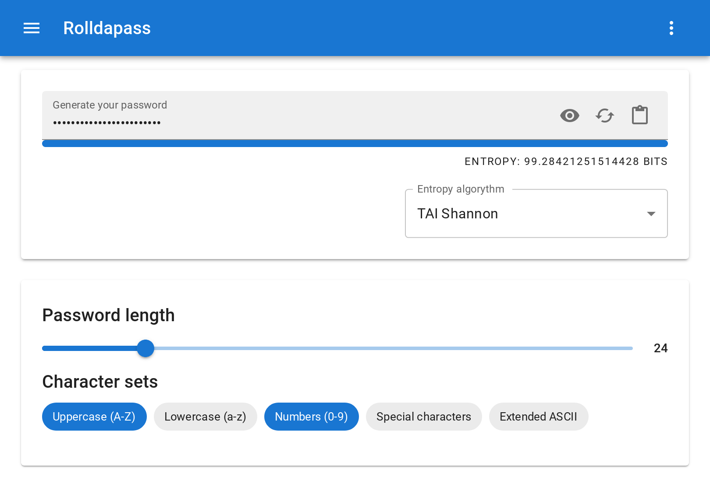

# Rolldapass


[](https://reactjs.org/)
[](https://www.typescriptlang.org/)
[](https://redux.js.org/)
[](https://mui.com/)

Customisable password generator. Features dark theme and auto checking password in HIBP.



## Building

Install dependencies:

```
npm install
```

Run build script:

```
npm run build
```

## Testing

Run test script:

```
npm test
```

Check for more info in [Create React App.](https://facebook.github.io/create-react-app/docs/running-tests)

## Running locally

Run live server script:

```
npm start
```

Note: no need to run the `eject` script.
